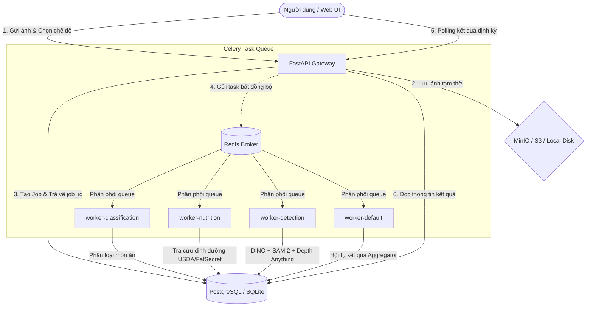

# TỔNG QUAN DỰ ÁN VIETNAMESE FOOD CLASSIFIER & NUTRITION ESTIMATOR
*(Tài liệu chuẩn bị cho NotebookLM - Phân tích Kiến trúc, Tính năng và Định hướng Nâng cấp)*

Dự án này là một ứng dụng toàn diện giúp người dùng nhận diện món ăn Việt Nam từ hình ảnh, phát hiện các thành phần nguyên liệu cấu thành, ước lượng khẩu phần (portion size), và tính toán hàm lượng dinh dưỡng (calo, protein, carbs, fat) một cách tự động thông qua AI.

---

## 1. KIẾN TRÚC HỆ THỐNG (SYSTEM ARCHITECTURE)

Hệ thống được thiết kế theo mô hình phân tán, bất đồng bộ nhằm tối ưu hóa việc sử dụng GPU/CPU và giảm thiểu độ trễ phản hồi cho người dùng.

### Sơ đồ luồng hoạt động (Mermaid Workflow)

### Các thành phần chính trong Tech Stack:
1. **Frontend / Client**:
   - **Streamlit App (`app.py`)**: UI gốc, thích hợp cho việc demo nhanh và so sánh độ chính xác giữa các mô hình.
   - **Figma-style Web UI (`static/`)**: Giao diện thiết kế đẹp mắt, tối ưu trải nghiệm người dùng, kết nối trực tiếp đến FastAPI Gateway qua các API bất đồng bộ.
2. **Backend API Gateway (`api/`)**:
   - Viết bằng **FastAPI**, chịu trách nhiệm điều phối luồng, quản lý cơ sở dữ liệu và lưu trữ, cung cấp các endpoint `/analyze`, `/jobs`, `/health`, `/explore`.
   - Phục vụ ứng dụng frontend tĩnh ngay trên đường dẫn gốc `/`.
3. **Mạng lưới Worker xử lý bất đồng bộ (`workers/`)**:
   - Chạy trên **Celery** và sử dụng **Redis** làm Message Broker.
   - Phân chia thành các Queue riêng biệt để scale độc lập (ví dụ: Worker phát hiện vật thể cần GPU được gom nhóm riêng).
4. **Cơ chế Dự phòng (Local Fallback System)**:
   - **Database**: Tự động chuyển đổi giữa **PostgreSQL** (production) và **SQLite** (`vnfood.db`, local dev).
   - **Cache**: Tự động chuyển đổi giữa **Redis Cache** và **In-memory dictionary** có thời gian sống (TTL).
   - **Storage**: Tự động chuyển đổi giữa **S3/MinIO** và **Thư mục local** (`storage/`).
   - **Celery**: Nếu Redis Broker bị sập hoặc không được cấu hình, hệ thống sẽ tự động chạy luồng xử lý đồng bộ bằng **FastAPI BackgroundTasks** làm fallback để đảm bảo ứng dụng không bao giờ bị gián đoạn.

---

## 2. LUỒNG XỬ LÝ PIPELINE & CÁC CHẾ ĐỘ HOẠT ĐỘNG

Người dùng có thể chọn một trong hai chế độ phân tích tùy theo nhu cầu tốc độ hoặc độ chính xác:

### Chế độ Nhanh (Fast Mode)
* **Thời gian xử lý**: 2 – 4 giây.
* **Mục tiêu**: Nhận diện món ăn tổng thể nhanh chóng và tra cứu dinh dưỡng cơ bản.
* **Quy trình**:
  1. Người dùng gửi ảnh.
  2. Mô hình phân loại món ăn (EfficientNet-B0 / ResNet-50) dự đoán tên món ăn.
  3. Hệ thống dùng tên món ăn tra cứu trực tiếp dinh dưỡng trên API của USDA và FatSecret.
  4. Trả về kết quả calo và macros.

### Chế độ Chính xác (Accurate Mode)
* **Thời gian xử lý**: 10 – 20 giây.
* **Mục tiêu**: Phân tích chi tiết từng nguyên liệu bên trong đĩa thức ăn để tính calo chính xác nhất.
* **Quy trình**:
  1. **Phân loại (Classification)**: Xác định tên món ăn tổng thể.
  2. **Tra cứu dinh dưỡng (Nutrition Lookup)**: Lấy dữ liệu dinh dưỡng vĩ mô của món ăn chính.
  3. **Phát hiện nguyên liệu (Ingredient Detection)**: Sử dụng mô hình **Grounding DINO** để phát hiện các hộp giới hạn (Bounding Boxes) của từng nguyên liệu (như cà rốt, thịt heo, bánh mì, rau thơm...).
  4. **Phân vùng chi tiết (Segmentation)**: Chuyển các box từ Grounding DINO sang **Segment Anything 2 (SAM 2)** để cắt mặt nạ (mask) chi tiết của từng nguyên liệu.
  5. **Tính toán khẩu phần (Portion Estimation)**: Sử dụng phương pháp **Area-ratio** (tỷ lệ diện tích của nguyên liệu so với diện tích đĩa thức ăn chuẩn 25cm) để ước lượng khối lượng gram của từng nguyên liệu.
  6. **Độ sâu trực quan (Depth Map)**: Sử dụng **Depth Anything V2** để sinh bản đồ độ sâu giúp trực quan hóa cấu trúc 3D của đĩa ăn.
  7. **Hội tụ kết quả (Aggregation)**: Cộng dồn calo và dinh dưỡng của đĩa ăn dựa trên khối lượng thực tế của từng nguyên liệu được phát hiện.

---

## 3. CÁC MÔ HÌNH HỌC MÁY ĐANG SỬ DỤNG (ML MODELS)

Hệ thống tải nóng (lazy-load) và giữ các mô hình luôn ở trạng thái sẵn sàng trong bộ nhớ RAM/VRAM của Worker thông qua lớp `ModelRegistry` để tránh overhead tải lại mô hình trong mỗi request:
* **EfficientNet-B0 / ResNet-50**: Phân loại các món ăn Việt Nam phổ biến (Phở, Cơm tấm, Bánh mì, Bún chả...).
* **Grounding DINO** (`IDEA-Research/grounding-dino-tiny`): Nhận diện nhãn nguyên liệu bằng văn bản (zero-shot object detection).
* **Segment Anything 2** (`facebook/sam2.1-hiera-small`): Phân vùng chính xác đa vật thể từ prompt là các bounding box từ DINO.
* **Depth Anything V2** (`depth-anything/Depth-Anything-V2-Small-hf`): Ước lượng chiều sâu của ảnh phục vụ việc vẽ bản đồ 3D đĩa ăn.

---

## 4. HƯỚNG CẢI THIỆN VÀ NÂNG CẤP (FUTURE IMPROVEMENTS)

Để dự án sẵn sàng chịu tải cho hàng chục ngàn người dùng và nâng cao trải nghiệm, các hướng cải thiện sau cần được ưu tiên:

### A. Tối ưu hóa Trải nghiệm người dùng (UX)
1. **Thay thế Polling bằng WebSockets**:
   - *Hiện tại*: Client liên tục gửi request GET định kỳ `/api/v1/jobs/{id}` để kiểm tra xem job đã xong chưa (Polling). Điều này gây tải lớn cho server.
   - *Cải tiến*: Thiết lập endpoint WebSocket `GET /api/v1/jobs/{id}/stream` để server chủ động push tiến trình xử lý thời gian thực (ví dụ: `25% - Phân loại xong`, `50% - Đang nhận diện nguyên liệu...`) đến client qua kết nối mở.

### B. Nâng cao Thuật toán ML & Xử lý dữ liệu
1. **Tuần tự hóa Mặt nạ nguyên liệu (Mask Serialization)**:
   - *Hiện tại*: Các mặt nạ phân vùng (masks) trả về từ SAM 2 dạng numpy array không thể tuần tự hóa sang JSON trực tiếp, hiện tại chỉ lưu trữ thống kê diện tích.
   - *Cải tiến*: Mã hóa các mặt nạ nhị phân thành ảnh PNG nén hoặc RLE (Run-Length Encoding) rồi lưu trữ trên S3, trả về link CDN để frontend có thể vẽ highlight đè lên ảnh gốc của người dùng.
2. **Cơ chế Phục vụ mô hình tập trung (Model Serving via Triton)**:
   - *Hiện tại*: Mỗi Celery Worker tự load mô hình vào RAM riêng lẻ. Khi scale số lượng worker, RAM/VRAM sẽ bị nhân bản gây lãng phí lớn (Overhead & Fragmentation).
   - *Cải tiến*: Triển khai **NVIDIA Triton Inference Server**. Các worker chỉ gửi ảnh qua gRPC/HTTP tới Triton Server để suy diễn. Triton sẽ tự động tối ưu hóa batching hình ảnh (dynamic batching) và phân phối tài nguyên GPU hiệu quả.

### C. Nâng cấp Hệ thống & Hạ tầng (Infrastructure)
1. **Chuyển đổi sang Temporal Workflow**:
   - *Hiện tại*: Sử dụng Celery Chain để liên kết các task. Khi một bước lỗi (ví dụ API USDA bị timeout), việc quản lý retry và khôi phục trạng thái khá phức tạp.
   - *Cải tiến*: Sử dụng **Temporal.io** để quản lý luồng công việc (Durable Execution). Temporal giúp tự động hóa retry, theo dõi trạng thái cực kỳ trực quan, và dễ dàng rẽ nhánh luồng công việc.
2. **Quản lý phân quyền & Bảo mật (Rate Limiting & Auth)**:
   - Thêm middleware giới hạn tần suất request (như `slowapi`) để tránh spam.
   - Tích hợp xác thực qua API Key/JWT cho endpoint `/analyze` để thương mại hóa hoặc quản lý người dùng.
3. **Nâng cấp tài khoản FatSecret**:
   - Đăng ký gói **FatSecret Premier Free** để loại bỏ giới hạn địa chỉ IP quốc tế (hiện tại gói Basic chặn các IP bên ngoài nước Mỹ, gây khó khăn cho việc triển khai ứng dụng tại Việt Nam).
