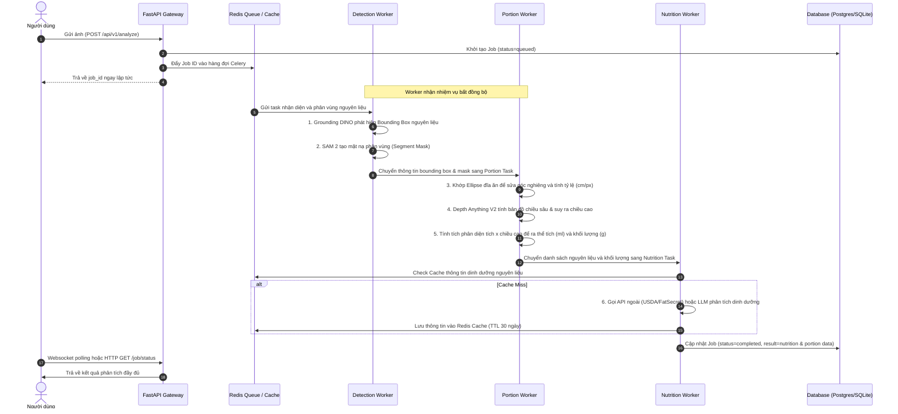

# PIPELINE WORKFLOW & CODEBASE DOCUMENTATION

Tài liệu này giải thích chi tiết luồng xử lý dữ liệu (AI Pipeline), kiến trúc mã nguồn (Codebase Architecture), cấu trúc các module và công nghệ lõi của dự án Munchin'.

---

## 1. LUỒNG XỬ LÝ PHÂN TÍCH ẢNH (AI SCANNER PIPELINE)

Khi người dùng tải lên hình ảnh món ăn để quét dinh dưỡng, hệ thống sẽ thực thi luồng công việc bất đồng bộ gồm 6 bước chính qua các worker chuyên biệt:



---

## 2. BẢN ĐỒ KIẾN TRÚC MÃ NGUỒN (CODEBASE ARCHITECTURE)

```text
c:/Users/Home/Desktop/vn food/
├── back-end/
│   ├── api/
│   │   ├── main.py              # Điểm khởi chạy FastAPI, CORS & WebSocket router
│   │   ├── auth.py              # Xử lý băm mật khẩu, tạo token phiên và dependencies
│   │   ├── routes.py            # Chứa toàn bộ các RESTful API & WebSocket endpoints
│   │   └── schemas.py           # Định nghĩa cấu trúc dữ liệu Pydantic (Request/Response)
│   ├── core/
│   │   ├── database.py          # Mô hình SQLAlchemy (User, Job, Session) & fallback SQLite
│   │   ├── settings.py          # Trình cấu hình Pydantic đọc biến môi trường từ .env
│   │   ├── cache.py             # Bộ nhớ đệm Redis lưu trữ kết quả tra cứu dinh dưỡng ngoài
│   │   ├── email.py             # Gửi OTP xác thực và reset mật khẩu qua SMTP / Mock stdout
│   │   └── model_registry.py    # Singleton quản lý & tải trước các mô hình AI (Torch/HF/ONNX)
│   ├── depth/
│   │   └── portion_estimator.py # Module xử lý thuật toán hình học đĩa ăn & tích phân thể tích 3D
│   └── workers/
│       ├── celery_app.py        # Cấu hình Celery Broker, Result Backend & model preloader
│       ├── classification_worker.py # Nhận dạng phân loại tên món ăn tổng thể
│       ├── detection_worker.py  # Chạy Grounding DINO + SAM 2 bóc tách nguyên liệu
│       ├── portion_worker.py    # Gọi module portion_estimator để tính toán khối lượng
│       ├── nutrition_worker.py  # Tra cứu dinh dưỡng các chất từ USDA/FatSecret
│       └── aggregator_worker.py # Tập hợp kết quả từ các worker trước và lưu vào DB
├── front-end/
│   └── static/                  # Chứa toàn bộ mã nguồn giao diện HTML/CSS/JS (SPA)
├── requirements.txt             # Danh sách tất cả thư viện Python cần thiết
└── run_local.bat / run_worker.bat # File script khởi chạy nhanh Backend và Celery Worker
```

---

## 3. GIẢI THÍCH MÃ NGUỒN CÁC MODULE CHỦ CHỐT

### A. Thuật toán Ước lượng Khẩu phần 3D ([portion_estimator.py](file:///c:/Users/Home/Desktop/vn%20food/back-end/depth/portion_estimator.py))
*   **Hiệu chỉnh đĩa ăn bằng Ellipse Fitting**:
    Sử dụng thuật toán `cv2.fitEllipse` trên đường viền lớn nhất của mặt nạ đĩa thức ăn. Bằng cách tính tỷ lệ giữa trục lớn (major axis) và trục nhỏ (minor axis), thuật toán xác định độ nghiêng góc chụp của camera (`tilt_ratio`). Tỷ lệ thực tế được tính bằng:
    $$Scale_{cm/px} = \frac{PlateDiameter_{real} (25cm)}{2 \times SemiMajorAxis_{px}}$$
    Diện tích thức ăn hiệu chỉnh thực tế là:
    $$Area_{cm^2} = FoodPixels \times Scale_{cm/px}^2 \times tilt\_ratio$$
*   **Tính toán Chiều cao 3D bằng Depth Map**:
    Lấy giá trị chiều sâu tương đối từ `Depth Anything V2`. Thuật toán thực hiện xói mòn hình thái học (`cv2.erode`) trên mặt nạ thức ăn để tìm vùng ranh giới đĩa tiếp xúc mặt bàn. Đo giá trị độ sâu trung vị (median depth) tại biên làm mốc đĩa (`base_depth`).
    Chiều cao vật lý của thức ăn tại mỗi pixel được suy ra bằng cách so sánh độ sâu thực tế của thức ăn với mốc đĩa. Thể tích thực tế được tính bằng tích phân diện tích nhân chiều cao:
    $$Volume_{ml} = Area_{cm^2} \times Height_{cm}$$
    Khối lượng thức ăn (gram) = Thể tích (ml) $\times$ Mật độ khối lượng điển hình của món ăn đó (g/ml).

### B. Quản lý Mô hình AI ([model_registry.py](file:///c:/Users/Home/Desktop/vn%20food/back-end/core/model_registry.py))
*   Được thiết kế dưới dạng **Singleton Pattern** để đảm bảo mỗi mô hình AI nặng chỉ được nạp lên RAM/VRAM một lần duy nhất trong vòng đời của tiến trình worker.
*   Hàm `preload` giúp nạp trước các mô hình khi Celery khởi động tiến trình con (thông qua tín hiệu `worker_process_init` của Celery), tránh tình trạng trễ phản hồi (latency spike) ở yêu cầu đầu tiên.

### C. Giao tiếp Bất đồng bộ ([celery_app.py](file:///c:/Users/Home/Desktop/vn%20food/back-end/workers/celery_app.py))
*   Sử dụng Redis làm Broker trung chuyển công việc. Định tuyến các task nặng về GPU (`worker-detection` đảm nhiệm DINO, SAM 2, Depth) và các task nhẹ về CPU (`worker-classification`, `worker-nutrition`), giúp phân bổ tài nguyên tối ưu và có thể scale độc lập.
