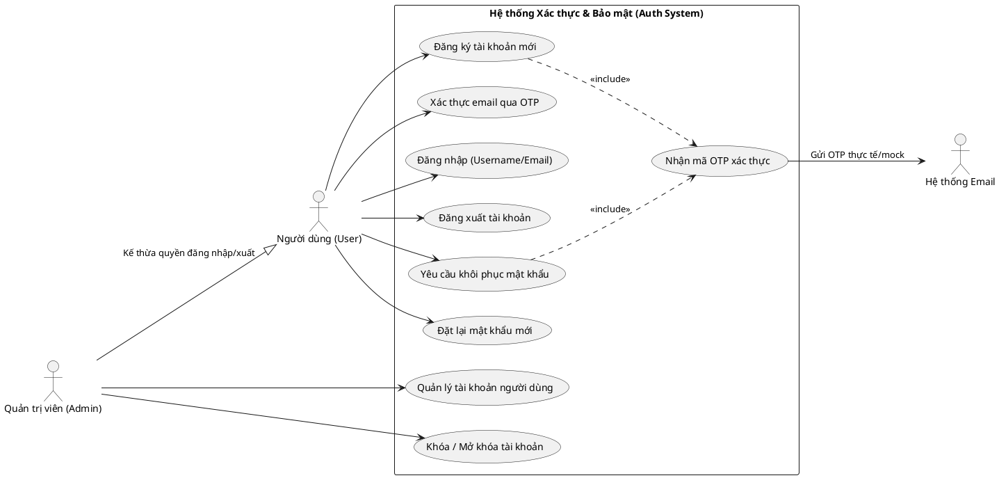
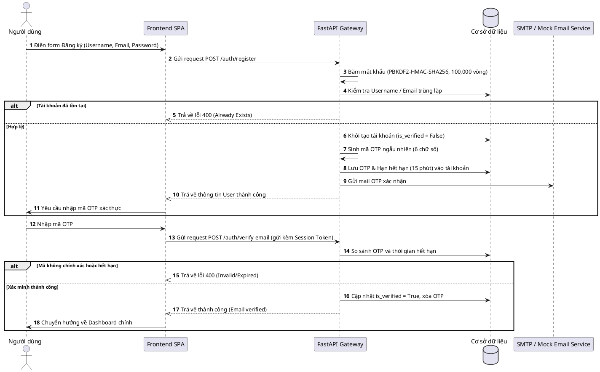
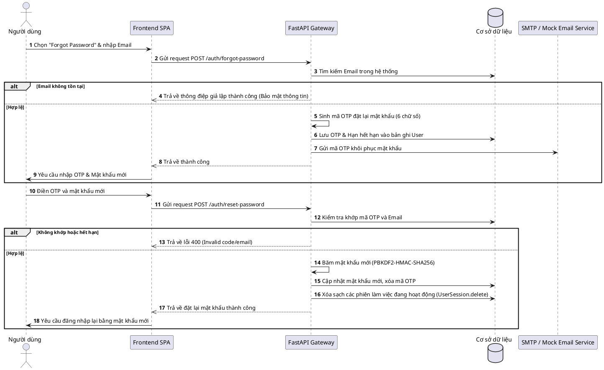

# Pipeline Xác Thực & Quản Lý Phiên Làm Việc (Authentication & Session Management)

Tài liệu này đặc tả chi tiết về hệ thống xác thực người dùng, bảo mật mật khẩu, xác minh email qua mã OTP, và cơ chế quản lý phiên làm việc trong dự án Munchin'.

---

## 1. Các Tính Năng & Trường Hợp Sử Dụng (Use Cases)

Hệ thống cung cấp các chức năng bảo mật cho hai đối tượng chính: **Thành viên (User)** và **Quản trị viên (Admin)**.

### Biểu đồ Use Case tổng quan

---

## 2. Quy Trình Hoạt Động (Flow of Operation)

### A. Luồng Đăng Ký & Xác Thực Email qua OTP
Khi đăng ký tài khoản, trạng thái mặc định của tài khoản sẽ là chưa xác thực (`is_verified = False`). Một mã OTP gồm 6 chữ số ngẫu nhiên được sinh ra và gửi tới email của người dùng.

### B. Luồng Quên & Đặt Lại Mật Khẩu (Forgot / Reset Password)
Trường hợp người dùng quên mật khẩu, hệ thống cho phép khôi phục qua Email OTP. Việc đặt lại mật khẩu thành công sẽ đi kèm cơ chế bảo mật tự động vô hiệu hóa toàn bộ các phiên đăng nhập (Session) cũ.

---

## 3. Cách Hoạt Động & Cơ Chế Kỹ Thuật

### A. Mã hóa mật khẩu (Password Hashing)
Hệ thống không bao giờ lưu trữ mật khẩu dưới dạng văn bản thuần (plain text).
- **Thuật toán**: Sử dụng thuật toán chuẩn công nghiệp `PBKDF2-HMAC-SHA256`.
- **Muối ngẫu nhiên (Salt)**: Mỗi mật khẩu được trộn với một chuỗi muối 16 byte sinh ngẫu nhiên trước khi băm, ngăn chặn các cuộc tấn công Rainbow Table.
- **Vòng lặp**: Áp dụng $100,000$ vòng lặp băm để làm chậm các nỗ lực tấn công dò mật khẩu (Brute-force).
- **Định dạng lưu trữ**: Chuỗi hash được lưu trong DB dưới dạng `<salt_hex>:<key_hex>`.

### B. Quản lý Phiên (Session Management)
- **Token Phiên**: Khi người dùng đăng nhập thành công qua `POST /auth/login`, hệ thống tạo ra một mã token 64 ký tự hex ngẫu nhiên (`secrets.token_hex(32)`).
- **Lưu trữ phiên**: Token được lưu trong bảng cơ sở dữ liệu `user_sessions`, liên kết trực tiếp với `user_id` và định nghĩa thời gian hết hạn (`expires_at`).
- **Thời hạn sử dụng**: Mặc định là **7 ngày** kể từ thời điểm tạo.
- **Xác thực API (Authorization Header)**: Client phải gửi Token này trong mỗi Request thông qua Header `Authorization: Bearer <session_token>`.
- **Đăng xuất**: Khi gọi `POST /auth/logout` hoặc thực hiện đổi mật khẩu, hệ thống thực thi xóa bản ghi phiên khỏi database, ngay lập tức vô hiệu hóa token đó.
- **Kiểm tra trạng thái kích hoạt**: Tại dependency kiểm tra token `get_current_user`, nếu trường `is_active` của User bằng `False` (do bị Admin khóa), API sẽ lập tức chặn quyền truy cập và trả về lỗi 403 Forbidden.
