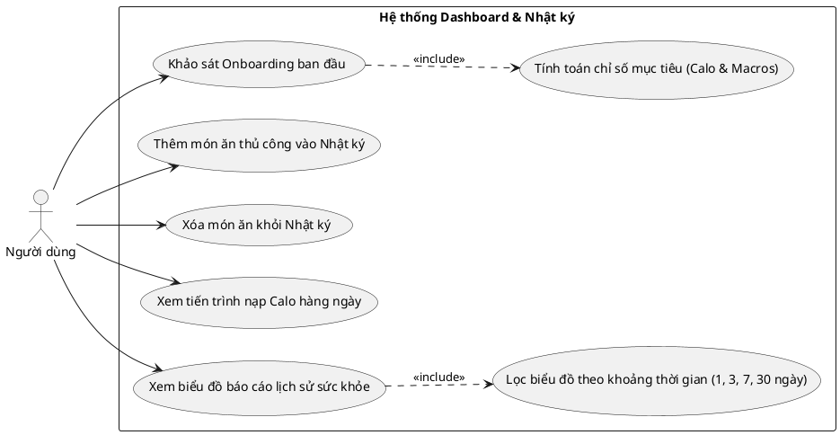
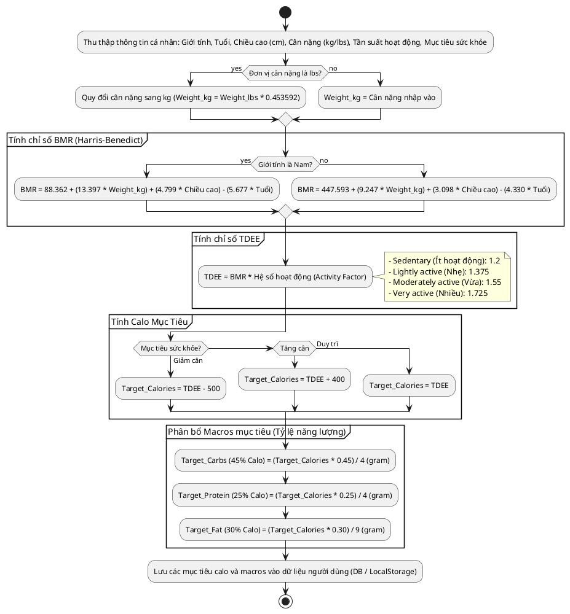
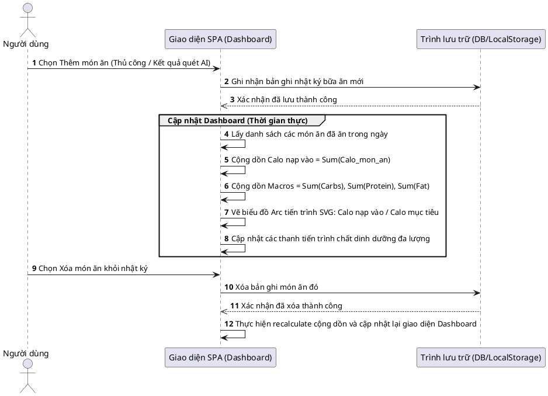

# Pipeline Bảng Điều Khiển Dinh Dưỡng & Nhật Ký Bữa Ăn (Dashboard & Meal Diary Pipeline)

Tài liệu này đặc tả cơ chế tính toán calo mục tiêu (BMR & TDEE), quy trình ghi nhận nhật ký bữa ăn hàng ngày, và luồng đồng bộ dữ liệu hiển thị biểu đồ báo cáo tiến trình sức khỏe trên giao diện Dashboard.

---

## 1. Các Tính Năng & Trường Hợp Sử Dụng (Use Cases)

Hệ thống hỗ trợ người dùng theo dõi sức khỏe và quản lý khẩu phần ăn hàng ngày thông qua các ca sử dụng sau:

---

## 2. Quy Trình Hoạt Động (Flow of Operation)

### A. Quy trình Onboarding & Tính toán Calo/Macros mục tiêu
Khi đăng ký tài khoản lần đầu, hệ thống thực hiện thu thập dữ liệu chỉ số cơ thể của người dùng để tính toán năng lượng tiêu thụ tự nhiên và thiết lập mục tiêu calo tối ưu.

### B. Luồng Nghiệp vụ Ghi Nhật ký Bữa ăn & Cập nhật Dashboard
Nhật ký bữa ăn được chia làm các nhóm chính (Bữa sáng, Bữa trưa, Bữa tối, Ăn vặt). Mỗi lần người dùng thêm mới (hoặc xóa) một món ăn, Dashboard và biểu đồ tiến trình sẽ lập tức tính toán lại giá trị cộng dồn.

---

## 3. Cơ Chế Hoạt Động Của Biểu Đồ Lịch Sử Tuần / Tháng

Biểu đồ báo cáo lịch sử (`progress-line-chart`) được thiết kế linh hoạt với khả năng hiển thị đa thông số và đa khoảng thời gian:

### A. Các Chỉ Số Sức Khỏe Hỗ Trợ (Metrics)
Tùy thuộc vào chỉ số được người dùng nhấp chọn trên Dashboard, biểu đồ sẽ cấu hình động:
- **Calories**: Màu chủ đề Coral (`#F05C3B`), Đơn vị `kcal`.
- **Carbs / Protein / Fat**: Màu chủ đề Xanh lá/Xanh nhạt/Cam, Đơn vị `g`.
- **Weight**: Màu chủ đề Xanh dương (`#007AFF`), Đơn vị `kg` hoặc `lbs`.
- **Active Burn (Exercise)**: Màu chủ đề Xanh lá tươi (`#30D158`), Đơn vị `kcal`.

### B. Bộ Lọc Khoảng Thời Gian (Duration Filter)
Giao diện cung cấp hộp thoại chọn khoảng thời gian lọc:
- **1 ngày / 3 ngày / 7 ngày / 30 ngày**:
  - Khi người dùng thay đổi lựa chọn thời gian, biểu đồ sẽ gửi yêu cầu truy xuất dữ liệu lịch sử tương ứng.
  - Hệ thống tính toán giá trị trung bình (`Avg`) dựa trên tổng số ngày trong khoảng lọc và hiển thị lên tiêu đề thẻ.
  - Trục hoành (X-Axis) tự động co giãn và điều chỉnh nhãn hiển thị phù hợp (ví dụ: hiển thị nhãn cách quãng 6 ngày một lần đối với bộ lọc 30 ngày để chống tràn văn bản trên màn hình di động).
