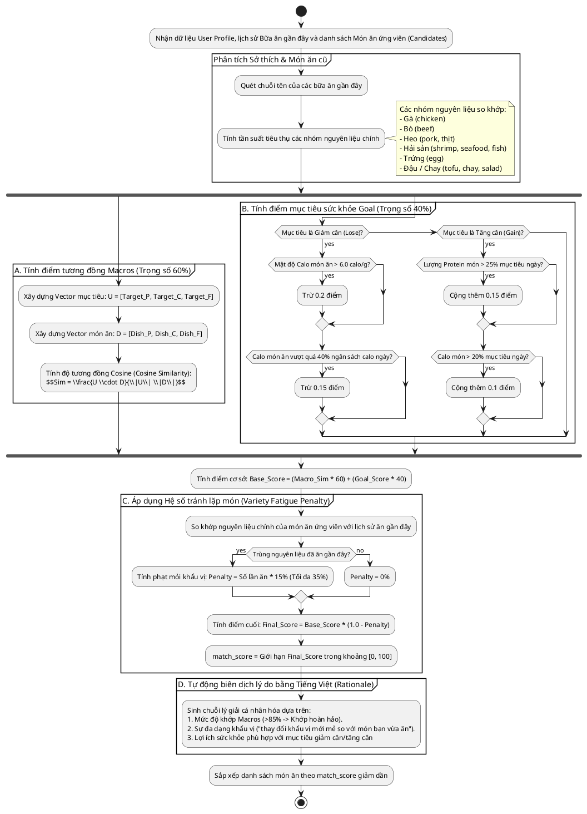

# Bộ Gợi Ý Thực Đơn Thông Minh (Personalized Recommendation Engine)

Tài liệu này đặc tả thuật toán đề xuất cá nhân hóa **Flavor AI Recommendation Engine**, giúp xếp hạng và chấm điểm mức độ phù hợp của các món ăn dựa trên mục tiêu cơ thể và lịch sử ăn uống gần đây của người dùng.

---

## 1. Các Tính Năng & Trường Hợp Sử Dụng (Use Cases)

Hệ thống giúp người dùng khám phá và lựa chọn món ăn tối ưu nhất cho tiến trình dinh dưỡng của họ.

```plantuml
@startuml
left to right direction
skinparam packageStyle rectangle

actor User as "Người dùng"
participant Engine as "Flavor AI Recommendation Engine"

rectangle "Hệ thống Khám phá & Gợi ý" {
    usecase "Khám phá danh sách món ăn truyền thống" as UC_explore
    usecase "Đề xuất món ăn cá nhân hóa" as UC_recommend
    usecase "Lọc thực đơn Thuần chay (Vegan)" as UC_filter_vegan
    usecase "Lọc món nước (Broth)" as UC_filter_broth
    usecase "Tìm kiếm công thức nấu ăn" as UC_search_recipe
}

User --> UC_explore
User --> UC_recommend
User --> UC_filter_vegan
User --> UC_filter_broth
User --> UC_search_recipe

UC_recommend --> Engine : Chấm điểm & Xếp hạng ứng viên
@endif
@enduml
```

---

## 2. Thuật Toán Chấm Điểm & Xếp Hạng Đề Xuất
Bất cứ khi nào người dùng truy cập tab Explore, hệ thống sẽ tự động quét danh mục món ăn ứng viên và chấm điểm phù hợp theo quy trình sau:



---

## 3. Cách Hoạt Động & Cơ Chế Kỹ Thuật

### A. Độ tương đồng Cosine (Cosine Similarity)
Hệ thống sử dụng góc giữa hai vector trong không gian 3 chiều (Protein, Carbs, Fats) để đo lường mức độ khớp tỷ lệ đa lượng, hoàn toàn độc lập với kích thước khẩu phần.
- Công thức: 
  $$\text{Cosine Similarity} = \frac{P_u P_d + C_u C_d + F_u F_d}{\sqrt{P_u^2 + C_u^2 + F_u^2} \times \sqrt{P_d^2 + C_d^2 + F_d^2}}$$
- Giá trị nằm trong khoảng $[0.0, 1.0]$. Giá trị càng gần $1.0$ chứng tỏ tỷ lệ phân bổ năng lượng giữa 3 chất dinh dưỡng của món ăn càng sát với mục tiêu của người dùng.

### B. Cơ chế ngăn chặn nhàm chán thực đơn (Fatigue Discount)
Để đảm bảo chế độ ăn của người dùng phong phú và lành mạnh, Flavor AI áp dụng hình phạt giảm điểm đối với các món ăn trùng lặp vị đạm chính đã ăn trong các ngày gần đây. Ví dụ, nếu người dùng đã ăn 2 bữa thịt gà gần đây, món "Phở gà" sẽ bị phạt $2 \times 15\% = 30\%$ điểm khớp, tạo điều kiện cho các món đạm khác như "Bún bò" hoặc "Đậu sốt cà chua" được xếp hạng cao hơn.

### C. Biên dịch Lý giải tự động (Personalized Rationale)
Rationales được tạo bằng cách ghép tối đa 2 lý do phù hợp nhất nhằm giải thích tại sao món ăn này lại có điểm số tương thích cao, giúp nâng cao độ tin cậy và thúc đẩy hành vi ăn uống lành mạnh của người dùng:
- *Ví dụ Giảm cân:* "Tỉ lệ dinh dưỡng (Macros) khớp hoàn hảo với mục tiêu của bạn. Lượng calo thấp, hỗ trợ giảm cân hiệu quả mà không lo đói."
- *Ví dụ Tăng cân:* "Cung cấp lượng Protein dồi dào, rất thích hợp cho cơ bắp. Mật độ dinh dưỡng cao giúp bạn dễ dàng đạt mục tiêu tăng cân."
