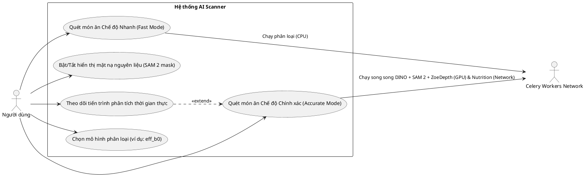
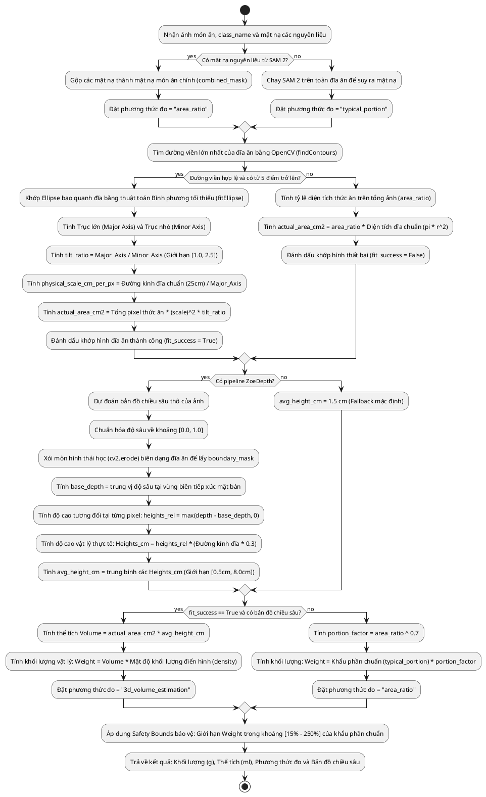

# Pipeline Quét Món Ăn AI (AI Scanner Pipeline)

Tài liệu này đặc tả chi tiết về quy trình thu nhận hình ảnh, phân tích bằng mô hình học sâu, tính toán thể tích/khối lượng 3D, tra cứu dinh dưỡng và cơ chế cập nhật thời gian thực qua WebSockets trong ứng dụng Munchin'.

---

## 1. Các Tính Năng & Trường Hợp Sử Dụng (Use Cases)

Bộ quét món ăn AI hỗ trợ người dùng quét hình ảnh để nhận diện món ăn và đo lường dinh dưỡng tự động theo hai chế độ chính: **Chế độ Nhanh (Fast Mode)** và **Chế độ Chính xác (Accurate Mode - 3D)**.



---

## 2. Quy Trình Hoạt Động (Flow of Operation)

### A. Luồng Xử Lý Bất Đồng Bộ (Celery Chord Workflow) & WebSocket Stream
Khi người dùng tải lên hình ảnh thức ăn ở chế độ Accurate, Gateway tiếp nhận, tải ảnh lên S3, ghi nhận Job và đẩy tác vụ bất đồng bộ xuống Celery Broker (Redis). Để tăng tốc tối đa, hệ thống chạy song song luồng **Tra cứu dinh dưỡng** (CPU/Network) và luồng **Bóc tách + Đo thể tích 3D** (GPU).

```plantuml
@startuml
autonumber
actor Client as "Trình duyệt User"
participant API as "FastAPI Gateway"
database DB as "Cơ sở dữ liệu"
queue Redis as "Redis Broker & Pub/Sub"
participant ClassWorker as "Worker Classification (CPU)"
participant DetWorker as "Worker Detection (GPU)"
participant PortWorker as "Worker Portion (GPU)"
participant NutWorker as "Worker Nutrition (CPU/Net)"
participant AggWorker as "Worker Aggregator (CPU)"

Client -> API: Gửi ảnh (POST /api/v1/analyze)
API -> DB: Khởi tạo Job (status = "queued")
API -> API: Tải ảnh gốc lên S3 (images/{job_id}/original.jpg)
API -> Redis: Đẩy chuỗi công việc Celery (chord/chain)
API -->> Client: Trả về job_id ngay lập tức
Client -> API: Kết nối WebSocket /jobs/{job_id}/stream
API -> Redis: Đăng ký (Subscribe) kênh "job_updates:{job_id}"

Note over ClassWorker, AggWorker: Celery Workers nhận nhiệm vụ
Redis -> ClassWorker: Chạy task classify_food
ClassWorker -> ClassWorker: Nhận diện món chính (mặc định eff_b0)
ClassWorker -> DB: Cập nhật class_name, confidence
ClassWorker -> Redis: Publish trạng thái "classification: completed"
Redis -->> API: Đẩy tín hiệu cập nhật qua Pub/Sub
API -->> Client: Gửi JSON tiến trình cập nhật UI (vòng xoay tiến trình)

Note over DetWorker, NutWorker: Hai luồng chạy song song sau khi có class_name
group Luồng 1: Đo đạc 3D & Phân vùng (GPU-bound)
    Redis -> DetWorker: Chạy task detect_ingredients_task
    DetWorker -> DetWorker: Grounding DINO phát hiệnbounding boxes nguyên liệu
    DetWorker -> DetWorker: SAM 2 tạo các mặt nạ nguyên liệu chính xác
    DetWorker -> DB: Lưu kết quả phân đoạn & lưu combined_mask.png lên S3
    DetWorker -> PortWorker: Kích hoạt estimate_portion_task
    PortWorker -> PortWorker: Chạy ZoeDepth tính bản đồ chiều sâu (depth_map.png)
    PortWorker -> PortWorker: Ước tính thể tích (Volume) và khối lượng (Weight)
    PortWorker -> DB: Lưu kết quả portion & lưu depth_map.png lên S3
end

group Luồng 2: Tra cứu dinh dưỡng (IO-bound)
    Redis -> NutWorker: Chạy task lookup_nutrition_task
    NutWorker -> Redis: Kiểm tra dinh dưỡng nguyên liệu trong Cache
    alt Cache Miss
        NutWorker -> NutWorker: Gọi API ngoài (USDA/FatSecret) tra cứu calo/macros
        NutWorker -> Redis: Lưu kết quả tra cứu vào Cache (TTL 30 ngày)
    end
    NutWorker -> DB: Cập nhật dinh dưỡng món ăn chính
end

DetWorker & PortWorker & NutWorker -> AggWorker: Nhập chung tại chord callback (aggregate_results)
AggWorker -> AggWorker: Đồng bộ khối lượng nguyên liệu & phân bổ dinh dưỡng tỉ lệ
AggWorker -> DB: Cập nhật Job (status = "completed")
AggWorker -> Redis: Publish trạng thái "completed" & Kết quả sau cùng
Redis -->> API: Nhận tín hiệu hoàn thành
API -->> Client: Trả về kết quả phân tích đầy đủ (JSON) và đóng WebSocket
Client -> Client: Hiển thị kết quả, vẽ biểu đồ macros, vẽ ảnh gốc ban đầu (tắt mask)\nNhấp "Xem ảnh phân tích" để bật hiển thị SAM 2 overlay
@enduml
```

### B. Cơ Chế Tự Phục Hồi & Fallback Cục Bộ (In-process Fallback)
Nếu dịch vụ Redis Broker hoặc hàng đợi Celery bị gián đoạn (offline) khi ứng dụng đang chạy:
1. API Gateway tự động bắt ngoại lệ kết nối Celery.
2. Hệ thống chuyển đổi luồng xử lý sang sử dụng **FastAPI BackgroundTasks** (chạy đa luồng ngay bên trong tiến trình của API Gateway).
3. Client kết nối WebSocket vẫn nhận được cập nhật bình thường nhờ vào cơ chế dò trạng thái chủ động (In-memory polling loop) thay thế cho Redis Pub/Sub.

---

## 3. Quy Trình Tính Toán Thể Tích & Khối Lượng 3D
Quy trình thuật toán hình học trong `portion_estimator.py` được thực hiện qua các bước cụ thể sau:


